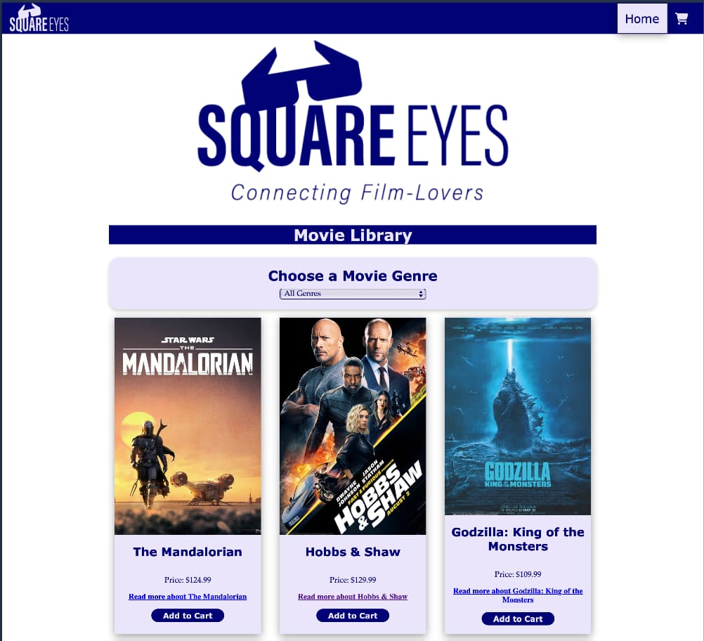

# JS1 Course Assignment - Square Eyes

A dynamic online movie store where users can browse movies, view product details, and manage a shopping cart.

## Description

Square Eyes is an interactive online movie store built during the JavaScript 1 course at Noroff. The goal of the project was to demonstrate the practical use of JavaScript — including working with APIs, dynamically generating content, and handling user interaction.

The store is powered by the Noroff Square Eyes API and allows users to browse movies, view details on individual product pages, add and remove items from a shopping cart, and complete a full checkout flow. Cart data is stored in localStorage, allowing it to persist between pages and refreshes.

The website was developed using modular JavaScript, with separate files dedicated to fetching API data, rendering dynamic content, and managing cart functionality.

## Built With

- HTML
- CSS
- JavaScript
- Noroff Square Eyes API
- GitHub

## Installing

Clone the repository: gh repo clone Martine04384/JS1-CA-Addison

## Running

This is a static HTML/CSS/JavaScript project — no installation or build tools are required.

To run the site locally:

1. Open the project folder
2. Open `index.html` in your browser

You can also view the live version here:  
[Live site on GitHub Pages](https://martine04384.github.io/JS1-CA-Addison/)

## Contributing

This is a student project and is not accepting contributions, but feel free to fork the repo for learning purposes.

## Contact

[My GitHub](https://github.com/martine04384)

## Acknowledgments

Thanks to Noroff for the project brief and assets.
Code reviews and feedback from instructors and peers.
